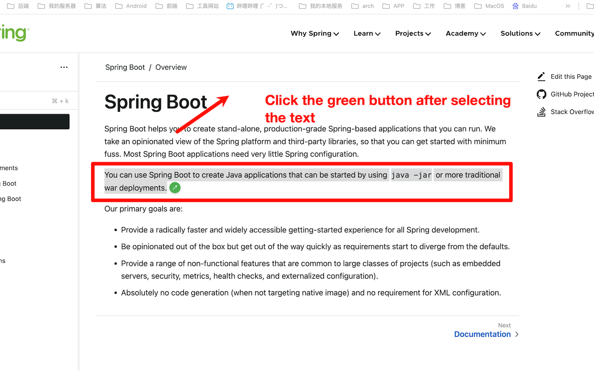
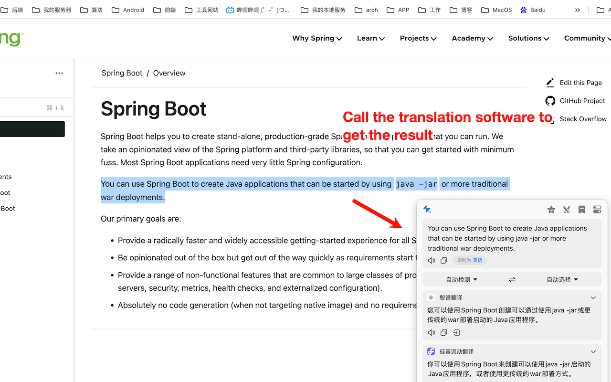

# Translate with Bob

[English](README_EN.md) | 中文

用来在chrome网页调用bob翻译实现划词翻译
## 效果




## 注意
使用时请确保bob翻译已经启动,不建议将项目放到下载目录、文档目录,仅支持MacOS系统
## 加载插件
chrome浏览器插件开启开启开发者模式选择add-on文件夹

## 确保路径存在(没有请创建)
```
ls ~/Library/Application\ Support/Google/Chrome/NativeMessagingHosts/
```
## 编译
```bash
cd app
go build -o translate_server main.go
chmod +x translate_server
```

## 配置
修改app/translate_server.json文件
path为刚刚编译的translate_server的绝对路径
allowed_origins为也要根据浏览器插件的id进行修改

然后复制配置文件到指定文件夹
```bash
cp app/translate_server.json ~/Library/Application\ Support/Google/Chrome/NativeMessagingHosts/
```
## 补充
app/main.go的 
```text
enableLogging控制是否开启日志
logFilePath控制日志路径
```text
默认不开启日志

